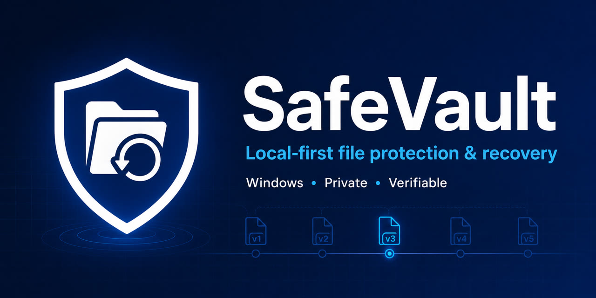

# SafeVault

[](https://github.com/Justin-147/safevault/actions/workflows/ci.yml)
[](https://github.com/Justin-147/safevault/releases)
[](https://www.python.org/)
[](https://github.com/Justin-147/safevault/releases/latest/download/SafeVaultSetup.exe)
[](LICENSE)

**[中文说明](README.zh-CN.md) | [Documentation](docs/README.md)**



**SafeVault is a local-first Windows file protection and recovery tool.** It
continuously protects selected folders, keeps recoverable file versions,
surfaces recent deletions in a local Recovery Home, and isolates risky AI
coding changes in a disposable project copy. Your protected content stays on
storage you control.

**[Download SafeVault for Windows](https://github.com/Justin-147/safevault/releases/latest/download/SafeVaultSetup.exe)** · [View the latest release](https://github.com/Justin-147/safevault/releases/latest) · [Read the install guide](docs/INSTALL_EN.md)

## Why SafeVault

- **Recover everyday mistakes:** restore recently deleted or overwritten files
  from a local browser interface.
- **Keep control of your data:** store versions locally with BLAKE3 integrity
  verification and SQLite metadata.
- **Install once on Windows:** optional background protection and tray startup
  are included in the installer.
- **Use AI coding tools more safely:** run supported workflows in a disposable
  project copy, then review and apply validated changes.

## Start Here

- New user: [Install Guide](docs/INSTALL_EN.md)
- Daily protection and recovery: [User Guide](docs/USER_GUIDE_EN.md)
- Common questions: [FAQ](docs/FAQ_EN.md)
- Chinese documentation: [README.zh-CN.md](README.zh-CN.md)

## What SafeVault Does

- Watches folders selected during onboarding or added later.
- Records automatic versions after file changes and deletion markers after
  tracked files disappear.
- Restores recently deleted files or earlier versions from Recovery Home.
- Stores content once in a BLAKE3-addressed object store and records metadata
  in SQLite.
- Creates before/after recovery points for supported AI coding workflows run
  through `safevault run`.
- Warns about unusually large change bursts and suspicious encrypted-file
  extensions.
- Exports verified backups to an external folder.

## Install

Windows users should install `SafeVaultSetup.exe`. The installer can start the
background daemon and tray at sign-in and opens the first-run wizard. Both
startup options are user-selectable.

Developers installing from source:

```bash
python -m venv .venv
pip install -e '.[dev,ui,tray]'
safevault ui --open
```

See the [Install Guide](docs/INSTALL_EN.md) for Windows startup, source install,
and uninstall details.

## First Run

The first-run wizard recommends existing folders such as Desktop, Documents,
and Pictures. Large project workspaces are optional, and custom paths can be
added directly. The Windows installer and onboarding ask where recovery data
should live; choose a non-system drive such as `D:\SafeVaultData` when
available. Select only the folders you want to protect. Setup returns
immediately while SafeVault builds initial recovery points in the background;
the browser page can then be closed.

Open the local Recovery Home at any time:

```bash
safevault ui --open
```

## Recover A File

Open Recovery Home, find the file under recent deletions or search, select a
recovery point, and choose Restore. SafeVault preserves an existing destination
before replacing it.

CLI recovery remains available for advanced users:

```bash
safevault recent deleted --since 24h
safevault restore /path/to/file --latest
```

## Protect AI Coding Work

```bash
safevault run --project /path/to/project -- codex
safevault apply <sandbox-id> --dry-run
safevault apply <sandbox-id>
```

The command runs in a copied project directory. Applying changes validates
paths, file types, hashes, symlinks, and conflicts. Deletions are skipped unless
`--allow-delete` is passed explicitly.

See [Codex Workflow](docs/zh/CODEX_WORKFLOW.md) for the detailed safety flow.

## How Recovery Works

SafeVault streams changed file content into an immutable BLAKE3 object store.
SQLite records protected roots, versions, deletion markers, events, snapshots,
and recovery points. Identical content is stored once. Restore verifies object
content before writing it back atomically.

## Storage Location And The 10 GB Target

Recovery Home's Storage page shows actual use, free space, the configured
target, per-root minimum estimates, and the largest tracked files. It can move
an existing vault to a new empty folder. Migration copies and verifies data
before switching locations and removes the old copy only after explicit
confirmation.

The default 10 GB value is a soft management target, not a destructive hard
cap. If one latest restorable copy of every selected file already exceeds 10
GB, no retention policy can preserve those files and also meet the target.
Narrow the protected scope or exclude replaceable media, installers, models,
datasets, and generated outputs. Identical content is deduplicated, but distinct
whole-file versions still consume object storage.

## Safety Boundaries

- SafeVault can restore only content captured after protection began.
- It does not perform raw-disk recovery or recover discarded SSD blocks.
- `safevault run` reduces accidental project changes but is not malware
  containment and does not isolate credentials, the network, or the user account.
- The watcher is best-effort; completed versions are the recovery source of
  truth.
- The 10 GB target is a soft budget. Smart retention remains planning/dry-run
  only in v1.1.8 and does not silently remove history.
- Local history does not protect against disk loss. Keep exports on an external
  disk, NAS, or another machine.

## Documentation

Use the [documentation index](docs/README.md) instead of browsing file names.
It separates user guides, advanced safety material, and release notes.

## Development And Release Checks

```bash
ruff check .
mypy src
pytest -q
python -m safevault --help
bash scripts/release_check.sh
```

SafeVault 1.1.8 requires Python 3.12 or later. See [CHANGELOG.md](CHANGELOG.md)
and [v1.1.8 release notes](docs/releases/v1.1.8.md) for release details.
